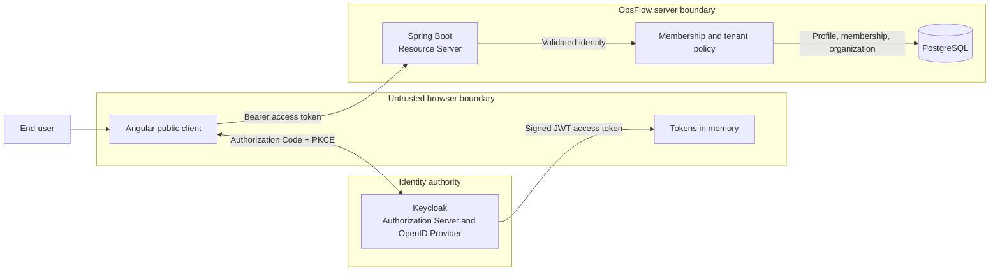
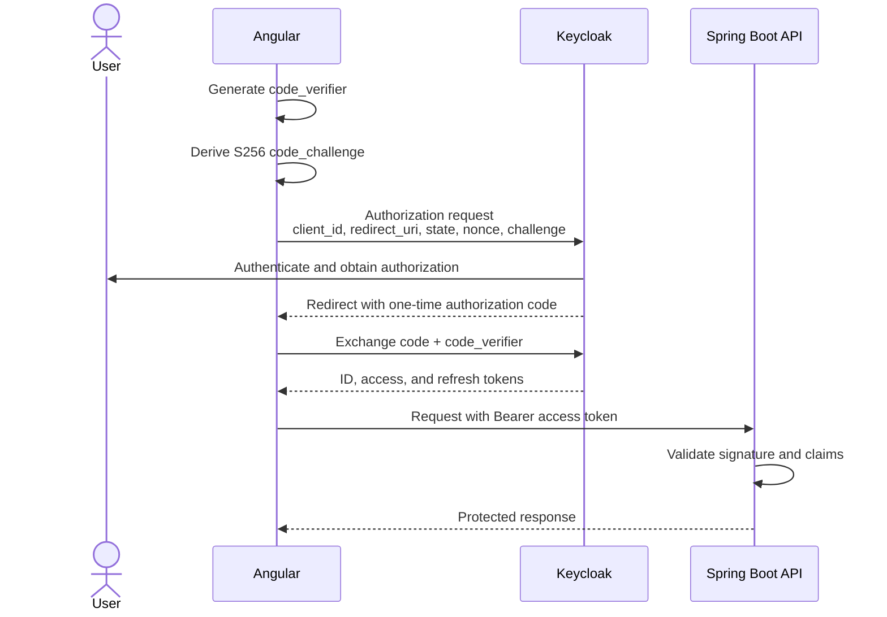
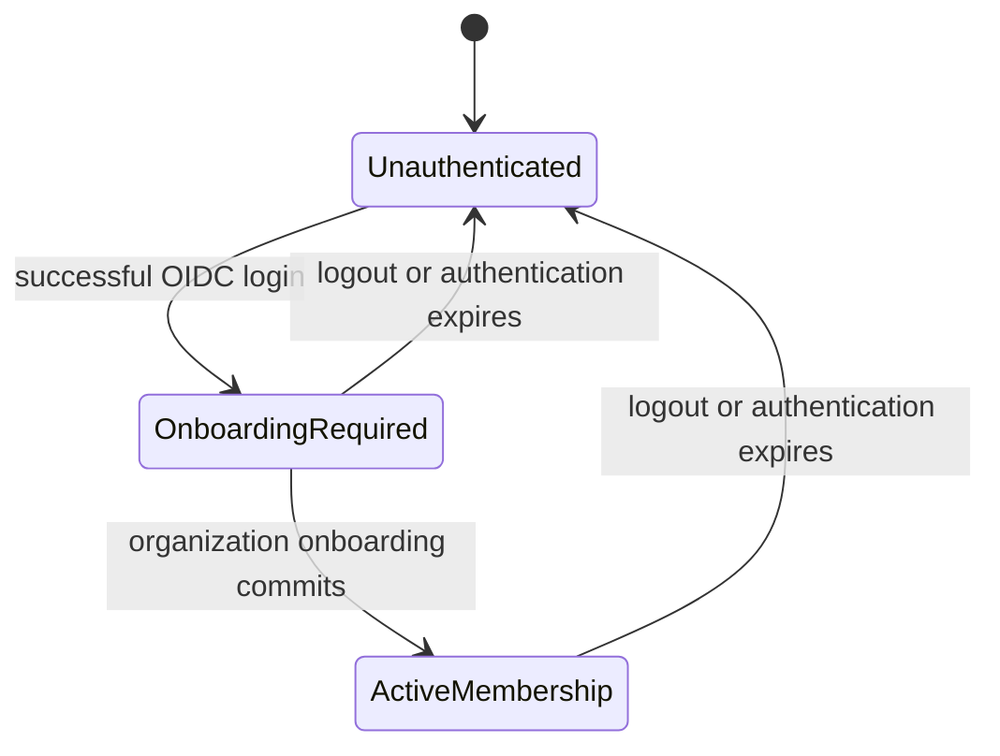

# M1 identity and tenancy design

- **Status:** Proposed
- **Milestone:** M1 — Identity & Organizations
- **Tracking issue:** [#25](https://github.com/Felipao724/opsflow/issues/25)
- **Last reviewed:** 2026-09-04

This document defines the security boundaries and intended end-to-end flow for
M1. It is a design input, not evidence that authentication or multi-tenancy is
already implemented. The implementation tickets may refine the details; the
accepted results will be recorded as ADRs when M1 is complete.

## Scope

M1 is intended to let a person authenticate through OpenID Connect, present a
JWT access token to the backend, create an initial OpsFlow organization, and
operate only within the tenant granted by a local membership.

This design covers:

- OAuth 2.0 and OpenID Connect actors and trust boundaries;
- Authorization Code with PKCE for the Angular public client;
- JWT validation and stable external identity;
- ownership of identity, token, and business state;
- first-login organization onboarding;
- representative threats, mitigations, assumptions, and revisit triggers.

It does not define production identity operations, final deployment topology,
compliance controls, or a complete threat model.

## Proposed direction

M1 is expected to use the following direction, subject to validation during
implementation:

- Keycloak acts as the local OpenID Provider and OAuth Authorization Server.
- Angular acts as a public OpenID Connect client.
- Angular uses Authorization Code with PKCE S256 and keeps tokens in memory.
- Spring Boot acts as an OAuth 2.0 Resource Server and validates JWT access
  tokens.
- Keycloak owns credentials and authentication; OpsFlow owns profiles,
  organizations, memberships, and business authorization.
- A validated `(issuer, subject)` pair locates an OpsFlow-owned `UserProfile`.
- PostgreSQL membership data, not a client-supplied tenant identifier, grants
  access to an organization.

These are proposed M1 choices rather than production commitments. The ADR work
at the end of M1 will record what was actually accepted and implemented.

## Actors

| Protocol role                          | OpsFlow participant     | Responsibility                                                         |
| -------------------------------------- | ----------------------- | ---------------------------------------------------------------------- |
| Resource owner / end-user              | Person using OpsFlow    | Authenticates and grants the client permission to act                  |
| Public client / Relying Party          | Angular web application | Starts login, receives the callback, obtains tokens, and calls the API |
| Authorization Server / OpenID Provider | Keycloak                | Authenticates the person and issues codes and tokens                   |
| Resource Server                        | Spring Boot backend     | Validates access tokens and protects OpsFlow resources                 |

PostgreSQL is not an OAuth actor. It is the Resource Server's authoritative
store for OpsFlow business state.

Angular is a public client because browser-delivered JavaScript cannot keep a
client secret confidential. No client secret will be embedded in the frontend.

## Trust boundaries



Values from Angular remain untrusted even after login. Route guards improve
navigation but are not a security boundary. Spring validates the access token,
and OpsFlow checks local membership before allowing tenant data access.

## Authentication and authorization ownership

Keycloak owns:

- credentials and password policies;
- identity-provider sessions;
- MFA or external identity-provider integration when introduced;
- authorization codes, access tokens, ID tokens, and refresh tokens;
- signing keys and OpenID Provider metadata.

OpsFlow owns:

- `UserProfile`;
- `Organization`;
- `Membership` and its business role;
- organization lifecycle and tenant selection;
- authorization over customers, work orders, and other future business data.

A valid token proves an authenticated external subject. It does not grant that
subject universal access to OpsFlow organizations.

## Authorization Code with PKCE

The Angular client will use Authorization Code with a fresh PKCE verifier for
each login attempt.



The authorization request includes the challenge but not the verifier. During
the token exchange, Keycloak hashes the presented verifier and compares it with
the original challenge. An intercepted authorization code cannot be redeemed
without the verifier held by the client instance that started the flow.

`state`, `nonce`, and PKCE have related but distinct purposes:

| Value                       | Primary purpose                                                      |
| --------------------------- | -------------------------------------------------------------------- |
| `state`                     | Correlate the callback with the initiating authorization request     |
| `nonce`                     | Bind the OpenID Connect response and ID token to the login attempt   |
| PKCE verifier and challenge | Bind authorization-code redemption to the initiating client instance |

A maintained OIDC adapter will generate and validate these values. OpsFlow will
not implement the protocol primitives manually.

The ID token is consumed by the OpenID Connect client as evidence of the login
event. The access token is the credential sent to the Resource Server. Angular
must not substitute an ID token for an API access token.

## JWT trust model

A JWT can be decoded without being trustworthy. Its claims become usable only
after Spring has validated the token.

The Resource Server must validate at least:

| Element   | Required property                                                  |
| --------- | ------------------------------------------------------------------ |
| Signature | Verifies with a trusted Keycloak public key selected through `kid` |
| Algorithm | Belongs to the explicitly accepted algorithm set                   |
| `iss`     | Exactly matches the configured OpsFlow realm issuer                |
| `aud`     | Contains the identifier for the OpsFlow API                        |
| `exp`     | Has not passed, allowing only deliberate clock skew                |
| `nbf`     | Has been reached, allowing only deliberate clock skew              |

The issuer is configured from trusted application configuration. The backend
must not discover and trust an arbitrary issuer merely because its URL appears
inside an unvalidated token.

Claims serve different purposes:

| Claim                                 | Meaning in M1                            | Authority                                  |
| ------------------------------------- | ---------------------------------------- | ------------------------------------------ |
| `iss`                                 | Identity authority that issued the token | Required for validation and identity scope |
| `sub`                                 | External subject within that issuer      | Stable external identity component         |
| `aud`                                 | Intended token recipient                 | Required API validation, not user identity |
| `exp`, `nbf`, `iat`                   | Token time information                   | Authentication validity, not membership    |
| `scope` or technical roles            | Coarse OAuth permission                  | May map to Spring authorities              |
| `email`, `name`, `preferred_username` | Display or synchronization candidates    | Informational, not stable identity         |
| `jti`                                 | Identifier for one token                 | Not a user identifier                      |

JWT payloads are signed, not confidential. Tokens must not contain passwords,
secrets, or unnecessary sensitive business data.

## Stable external identity

OpsFlow identifies the external principal by the pair:

```text
(issuer, subject)
```

`sub` is unique only within its issuer. The same subject string from two
different issuers represents two different external identities.

Email is mutable and is therefore not the lookup key. Changing email, display
name, username, or password must not create a new OpsFlow profile while the
validated `(issuer, subject)` remains unchanged.

The intended local relationship is:

```text
ExternalIdentity
├── issuer
└── subject
        │
        ▼
UserProfile
└── OpsFlow-owned ID
        │
        ▼
Membership
├── role
└── organizationId
        │
        ▼
Organization
```

Future business tables will reference the OpsFlow-owned profile ID, not a raw
Keycloak subject. The implemented profile schema enforces uniqueness for
`(issuer, subject)`.

Changing identity provider or realm changes the issuer and possibly the
subject. Such a migration requires explicit account linking or data migration;
matching email alone must not transfer organization access.

## State ownership

| Location                        | Authoritative state                                                         |
| ------------------------------- | --------------------------------------------------------------------------- |
| Keycloak                        | Credentials, authentication factors, provider session, signing keys, tokens |
| Angular memory                  | Temporary client authentication state and tokens                            |
| Spring Security request context | Validated principal for the current request                                 |
| OpsFlow PostgreSQL              | User profiles, organizations, memberships, and business roles               |

Organization memberships will not be copied wholesale into JWTs in M1. Local
lookup avoids stale tenant roles remaining authoritative until a token expires
and keeps product rules independent from the identity provider.

## First-login onboarding

Authentication and product onboarding are separate state transitions:



An authenticated subject with no local profile receives a defined
`ONBOARDING_REQUIRED` application state. Angular then asks only for the minimum
organization information required by the domain.

The onboarding request must not accept issuer, subject, initial role, or user ID
as client-controlled identity inputs. Spring derives external identity from the
validated principal.

The onboarding use case creates the following in one database transaction:

1. `UserProfile` linked to the validated external identity;
2. the initial `Organization`;
3. an `OWNER` `Membership` joining the profile to the organization.

All three changes commit or all three roll back. The use case will not call
Keycloak while holding the database transaction; successful JWT validation has
already established the external identity.

For M1, a second or concurrent onboarding attempt is expected to produce a
defined conflict rather than create another organization. Database uniqueness
constraints provide the final concurrency defense. After a conflict, the client
can reload its current context to determine whether the first request succeeded.

## Expected failure states

| Condition                                                | Expected outcome                                                      |
| -------------------------------------------------------- | --------------------------------------------------------------------- |
| Missing, malformed, invalid, or expired access token     | `401 Unauthorized`                                                    |
| Valid identity without local onboarding                  | Successful current-context response with `ONBOARDING_REQUIRED`        |
| Invalid organization input                               | `400 Bad Request` with a safe validation response                     |
| Onboarding already completed or concurrent request loses | `409 Conflict`, followed by context refresh                           |
| Any write fails during onboarding                        | Transaction rollback; no partial profile, organization, or membership |
| Authenticated subject lacks required membership          | `403 Forbidden`                                                       |
| Subject attempts access to another tenant                | Denied without disclosing unnecessary tenant information              |

Internal errors must not expose tokens, authorization codes, SQL, full claims,
identity-provider configuration, or identifiers from an unauthorized tenant.

## Threats and mitigations

| Threat                                       | M1 mitigation                                                     | Residual or future work                                      |
| -------------------------------------------- | ----------------------------------------------------------------- | ------------------------------------------------------------ |
| Redirect URI manipulation                    | Narrow pre-registered redirect and post-logout URIs               | Production URI and proxy review                              |
| Authorization-code interception or injection | One-time code and PKCE S256                                       | Rely on provider and maintained adapter correctness          |
| Login callback CSRF or replay                | Per-request `state`, `nonce`, and PKCE validation                 | Browser and provider interoperability testing                |
| Modified JWT                                 | Trusted signature verification and algorithm restrictions         | Signing-key operations remain provider-owned                 |
| Token from another issuer or API             | Exact issuer and audience validation                              | Multi-issuer support requires a new design                   |
| Expired or premature token                   | `exp` and `nbf` validation with limited clock skew                | Clock synchronization in production                          |
| Token theft through browser storage          | Keep tokens in memory; never log or persist them                  | CSP, dependency hardening, BFF, or sender-constrained tokens |
| Bearer-token replay                          | Short lifetime, TLS outside localhost, narrow audience and scopes | BFF or DPoP if risk requires stronger sender binding         |
| Cross-tenant identifier manipulation         | Resolve membership server-side and scope protected operations     | Reusable enforcement in every future module                  |
| Stale organization role in token             | PostgreSQL membership remains authoritative                       | Caching requires explicit invalidation policy                |
| Sensitive values in logs or errors           | Exclude tokens, codes, raw claims, and internals                  | Central log-redaction policy before production               |
| Concurrent onboarding                        | Transaction and database uniqueness constraints                   | Define final retry semantics during implementation           |

## Browser client versus BFF

M1 proposes a browser-based OAuth client because it exposes Authorization Code,
PKCE, JWT bearer authentication, and Resource Server validation as explicit
learning and implementation concerns.

A Backend for Frontend would instead keep OAuth tokens server-side and give the
browser an HttpOnly session cookie. This reduces direct JavaScript token
exposure but introduces a confidential server client, sessions, cookie and CSRF
controls, API proxying, and additional operational responsibilities.

Reconsider the browser-client pattern when:

- the application handles data whose sensitivity makes browser token exposure
  unacceptable;
- regulatory or organizational policy requires a BFF;
- XSS risk or dependency surface grows materially;
- multiple Resource Servers make browser token lifecycle difficult;
- production identity integration requires centralized session behavior; or
- measured security requirements justify the additional server component.

Choosing a BFF later would require a new ADR; it would not be treated as a
routine refactor.

## M1 assumptions and non-production limitations

- Keycloak is the local development provider; the production provider remains
  undecided.
- Keycloak development mode and local HTTP are not production configuration.
- Production communication requires TLS and reviewed proxy/hostname settings.
- One onboarded user has one initial organization in M1.
- `OWNER` is the only membership role required by the onboarding slice.
- Invitations, account linking, organization switching, MFA, email delivery,
  recovery, and social identity providers remain out of scope.
- No high availability, backup, disaster recovery, penetration test, or
  compliance claim is made.
- Token lifetimes, refresh behavior, and Keycloak storage will be finalized by
  their implementation tickets and documented afterward.

## Open questions for implementation

- Will local Keycloak use embedded development storage or a dedicated
  PostgreSQL database?
- Which maintained Angular OIDC integration will own startup, renewal, and
  callback processing?
- Which exact audience and scope mapping will represent `opsflow-api`?
- Which clock skew and token lifetimes are appropriate for local development?
- Should repeated onboarding return only `409 Conflict`, or can a strictly
  equivalent retry return the existing context safely?
- Which profile claims may be synchronized, and only under which verification
  conditions?
- Which compatibility check requires a real Keycloak instance in CI, rather
  than a generated or mocked JWT?

These questions must be answered by the ticket that owns the corresponding
implementation. They do not block the boundary decisions captured here.

## References

- [OAuth 2.0 roles and protocol flow — RFC 6749](https://www.rfc-editor.org/rfc/rfc6749.html)
- [Proof Key for Code Exchange — RFC 7636](https://www.rfc-editor.org/rfc/rfc7636.html)
- [JSON Web Token claims — RFC 7519](https://www.rfc-editor.org/rfc/rfc7519.html)
- [OAuth 2.0 Security Best Current Practice — RFC 9700](https://www.rfc-editor.org/rfc/rfc9700.html)
- [OpenID Connect Core 1.0](https://openid.net/specs/openid-connect-core-1_0-final.html)
- [OAuth 2.0 for browser-based applications](https://datatracker.ietf.org/doc/draft-ietf-oauth-browser-based-apps/)
- [Spring Security OAuth 2.0 Resource Server](https://docs.spring.io/spring-security/reference/servlet/oauth2/resource-server/index.html)
- [Keycloak JavaScript adapter](https://www.keycloak.org/securing-apps/javascript-adapter)
