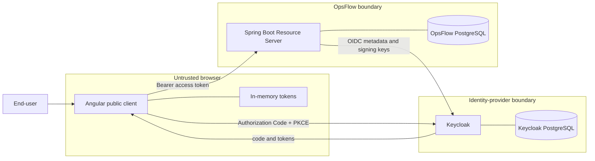
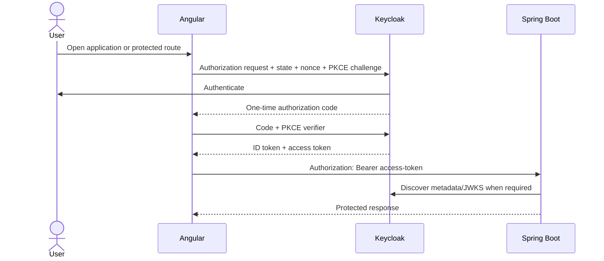
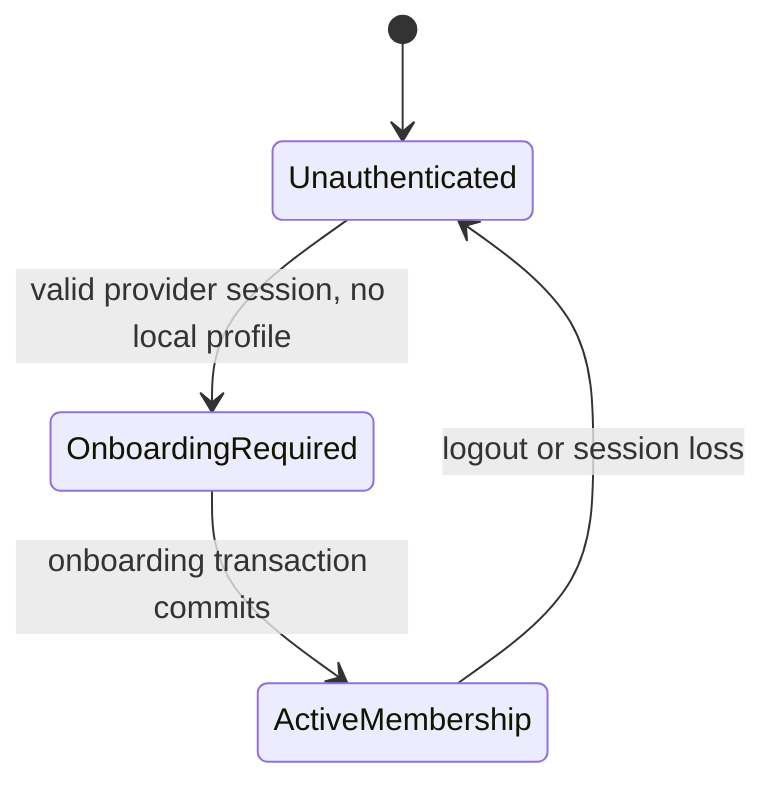
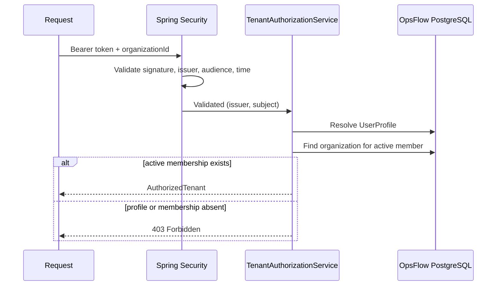

# M1 identity and tenancy architecture

- **Status:** Implemented
- **Milestone:** M1 — Identity & Organizations
- **Tracking issue:** [#40](https://github.com/Felipao724/opsflow/issues/40)
- **Last reviewed:** 2026-10-02

This guide describes the authentication, local identity, onboarding, and tenant
authorization architecture implemented in M1. It is a current-state guide, not
a production deployment runbook or a generic OAuth tutorial.

## Implemented scope

M1 allows a person to authenticate through OpenID Connect, call the backend
with a JWT access token, create an initial OpsFlow organization, and access an
organization only through an active local membership.

The implemented boundary is deliberately split into three questions:

| Question | Authoritative component | Evidence |
| --- | --- | --- |
| Who authenticated this request? | Keycloak plus Spring Security JWT validation | Validated `(issuer, subject)` |
| Which OpsFlow profile represents that identity? | Identity module and OpsFlow PostgreSQL | `UserProfile` lookup by `(issuer, subject)` |
| Which organization may that profile access? | Local active membership | Tenant-scoped repository lookup and `AuthorizedTenant` |

A valid token answers only the first question. It never grants organization
access by itself.

## Actors and trust boundaries


```mermaid
flowchart LR
    user[End-user]

    subgraph browser[Untrusted browser]
        angular[Angular public client]
        memory[In-memory tokens]
        angular --- memory
    end

    subgraph provider[Identity-provider boundary]
        keycloak[Keycloak]
        keycloakdb[(Keycloak PostgreSQL)]
        keycloak --- keycloakdb
    end

    subgraph application[OpsFlow boundary]
        spring[Spring Boot Resource Server]
        opsdb[(OpsFlow PostgreSQL)]
        spring --- opsdb
    end

    user --> angular
    angular -->|Authorization Code + PKCE| keycloak
    keycloak -->|code and tokens| angular
    angular -->|Bearer access token| spring
    spring -->|OIDC metadata and signing keys| keycloak
```

- Keycloak owns credentials, authentication factors, provider sessions,
  authorization codes, tokens, and signing keys.
- Angular starts login and presents a bearer access token only to the configured
  OpsFlow API origin and path.
- Spring Security validates the token before application code reads the
  principal.
- OpsFlow PostgreSQL owns profiles, organizations, memberships, and business
  roles. It contains no passwords or browser tokens.

PostgreSQL is not an OAuth actor. An OpsFlow organization is not a Keycloak
realm.

## Authorization Code with PKCE

`opsflow-web` is a public client because downloaded browser code cannot protect
a client secret. It uses Authorization Code flow with PKCE `S256`; implicit and
password-style direct grants are disabled.


```mermaid
sequenceDiagram
    actor User
    participant Angular
    participant Keycloak
    participant API as Spring Boot

    User->>Angular: Open application or protected route
    Angular->>Keycloak: Authorization request + state + nonce + PKCE challenge
    Keycloak->>User: Authenticate
    Keycloak-->>Angular: One-time authorization code
    Angular->>Keycloak: Code + PKCE verifier
    Keycloak-->>Angular: ID token + access token
    Angular->>API: Authorization: Bearer access-token
    API->>Keycloak: Discover metadata/JWKS when required
    API-->>Angular: Protected response
```

The exact local callback is `http://localhost:4200/auth/callback`. The adapter
also uses `http://localhost:4200/silent-check-sso.html` for session restoration
and `http://localhost:4200/` after logout. These URLs must remain registered in
the local realm.

## JWT trust model

The backend is a stateless OAuth 2.0 Resource Server. Before application code
uses a principal, Spring Security verifies:

- the signature against keys discovered from the trusted provider;
- the exact issuer `http://localhost:8081/realms/opsflow` by default;
- the required `opsflow-api` audience;
- token expiry and other supported time validation; and
- supported signing behavior.

The access token is for the API. The ID token is for the OpenID Connect client
and is not accepted as an API credential. Decoding a JWT payload is not token
validation.

Relevant claims have deliberately different jobs:

| Claim | Use |
| --- | --- |
| `iss` + `sub` | Stable external identity after validation |
| `aud` | Proves the token was issued for `opsflow-api` |
| `exp`, `nbf`, `iat` | Time validity |
| scopes or technical roles | Coarse API capabilities when configured |
| `email`, `name`, `preferred_username` | Optional display/synchronization data, never identity keys |

JWT payloads are signed, not encrypted. They must not contain passwords,
provider secrets, or unnecessary business data.

## Stable external identity

OpsFlow identifies an external principal by:

```text
(issuer, subject)
```

`sub` is unique only within one issuer. Email and username are mutable and are
not account keys. A provider or realm migration can change issuer or subject;
that requires explicit account linking or data migration, never automatic
matching by email.

```text
ExternalIdentity (issuer, subject)
        │
        ▼
UserProfile (OpsFlow-owned UUID)
        │
        ▼
Membership (role, status, organizationId)
        │
        ▼
Organization
```

Future business records reference OpsFlow-owned identifiers rather than raw
Keycloak subjects.

## Browser authentication lifecycle

Angular initializes the Keycloak adapter with `check-sso`, standard flow, PKCE
`S256`, and an in-memory authentication state. It distinguishes loading,
authenticated, unauthenticated, and provider/token failure outcomes.

The API bearer interceptor asks the adapter for a valid token, renews it when it
is near expiry, and attaches it only when both the request origin and API path
match the configured OpsFlow backend. It never sends the token to arbitrary
origins or unrelated paths.

Route guards preserve an approved requested path and redirect unauthenticated
navigation through login. Only the allowlisted return URL is stored temporarily
in `sessionStorage`; tokens are not. Client guards improve navigation but do
not enforce data access—the backend remains authoritative.

### Why tokens are not persisted

The Keycloak JavaScript adapter stores access and refresh tokens in memory.
OpsFlow deliberately does not copy them to `localStorage`, `sessionStorage`,
IndexedDB, a database, logs, or application URLs. Persistent browser storage
would increase the time in which a stolen token can be recovered and replayed.

This choice limits rather than eliminates browser risk: malicious script that
executes in the active page can still reach in-memory application state. A BFF,
Content Security Policy, dependency controls, and stronger token-binding
mechanisms remain possible future defenses.

## First-login onboarding

Authentication and product onboarding are separate transitions:


```mermaid
stateDiagram-v2
    [*] --> Unauthenticated
    Unauthenticated --> OnboardingRequired: valid provider session, no local profile
    OnboardingRequired --> ActiveMembership: onboarding transaction commits
    ActiveMembership --> Unauthenticated: logout or session loss
```

The onboarding request contains only the organization name. It cannot supply
issuer, subject, profile ID, or initial role. The backend derives external
identity from the validated Spring Security context.

One transaction creates:

1. a `UserProfile` linked to the validated external identity;
2. the initial `Organization`; and
3. an active `OWNER` membership joining them.

All three changes commit or roll back together. A repeated or concurrent attempt
produces a safe conflict, after which Angular reloads the identity context.

## Tenant authorization

For access to a requested organization, `TenantAuthorizationService` resolves
the validated external identity to a local profile and requires an `ACTIVE`
membership through a repository query scoped by organization and profile.


```mermaid
sequenceDiagram
    participant Request
    participant Security as Spring Security
    participant Authz as TenantAuthorizationService
    participant DB as OpsFlow PostgreSQL

    Request->>Security: Bearer token + organizationId
    Security->>Security: Validate signature, issuer, audience, time
    Security->>Authz: Validated (issuer, subject)
    Authz->>DB: Resolve UserProfile
    Authz->>DB: Find organization for active member
    alt active membership exists
        Authz-->>Request: AuthorizedTenant
    else profile or membership absent
        Authz-->>Request: 403 Forbidden
    end
```

The browser-provided organization ID identifies the requested resource; it does
not prove access. Memberships are not copied wholesale into JWTs, so local
membership changes become authoritative without waiting for token expiry.

## Failure classification

| Layer | Representative failure | Expected outcome |
| --- | --- | --- |
| Protocol configuration | Invalid redirect, issuer metadata, client, or PKCE configuration | Login/provider failure; inspect realm and URLs |
| Token validation | Missing, malformed, expired, wrongly signed, wrong issuer, or wrong audience token | `401 Unauthorized` |
| Business authorization | Valid identity without required active membership | `403 Forbidden` |
| Identity lifecycle | Valid identity without local profile | `ONBOARDING_REQUIRED` context |
| Input validation | Invalid organization name | `400 Bad Request` with safe field errors |
| Concurrency/lifecycle | Already-completed onboarding | `409 Conflict`, then context reload |
| Unexpected application failure | Unclassified backend or UI error | Safe generic response; no token, SQL, or tenant leakage |

This classification is reflected in backend tests, frontend state tests, and
the isolated Keycloak contract CI job.

## Operational verification

- Backend tests use generated signed JWTs to verify actual issuer, audience,
  expiry, and signing-key validation without a developer Keycloak instance.
- HTTP security tests use Spring Security test JWTs for request-boundary rules;
  those tests intentionally do not prove cryptographic validation.
- Tenant tests exercise local authorization and negative cross-tenant paths.
- Frontend tests cover adapter state, bearer attachment, protected navigation,
  return URLs, context loading, and onboarding outcomes.
- CI imports the committed realm into disposable Keycloak/PostgreSQL containers,
  verifies the static realm contract and live OpenID Provider metadata, then
  deletes the temporary state.

See [`infrastructure/README.md`](../../infrastructure/README.md) for local
startup, shutdown, reset, and troubleshooting.

## Non-production limitations

- Keycloak runs in development mode over local HTTP with local bootstrap
  credentials. Production requires TLS and reviewed hostname, proxy, secret,
  storage, backup, and high-availability configuration.
- The production identity provider is undecided.
- The current product supports one initial organization and only the `OWNER`
  role in the implemented flow.
- Invitations, organization switching, account linking, service accounts,
  social login, MFA policy, email delivery, recovery, and user administration
  are not implemented.
- There is no production key-rotation runbook, centralized token/log redaction
  policy, penetration test, compliance claim, disaster recovery, or formal
  threat model.
- Browser bearer tokens are not sender-constrained. A BFF or DPoP may be
  considered if the risk profile requires it.
- Local membership checks are application-enforced; PostgreSQL row-level
  security is not configured.

## Revisit triggers

Reconsider Keycloak or the provider abstraction when production requirements,
support policy, hosting constraints, or required identity capabilities cannot
be met safely by the selected provider.

Reconsider the direct browser client and adopt a BFF when data sensitivity,
organizational policy, XSS exposure, multiple Resource Servers, centralized
session behavior, or measured operational needs justify server-side tokens and
the added cookie, CSRF, session, and proxy responsibilities.

Either change requires a new ADR rather than an undocumented configuration
switch.

## References

- [ADR-0009: Use an external OpenID Connect provider](decisions/0009-use-an-external-openid-connect-provider.md)
- [ADR-0010: Authorize tenants with local memberships](decisions/0010-authorize-tenants-with-local-memberships.md)
- [OpenID Connect Core 1.0](https://openid.net/specs/openid-connect-core-1_0-final.html)
- [OAuth 2.0 for Browser-Based Applications — RFC 10017](https://www.rfc-editor.org/rfc/rfc10017.html)
- [OAuth 2.0 Security Best Current Practice — RFC 9700](https://www.rfc-editor.org/rfc/rfc9700.html)
- [Keycloak JavaScript adapter](https://www.keycloak.org/securing-apps/javascript-adapter)
- [Keycloak hostname configuration](https://www.keycloak.org/server/hostname)
- [Spring Security OAuth 2.0 Resource Server JWT](https://docs.spring.io/spring-security/reference/servlet/oauth2/resource-server/jwt.html)
- [Angular HTTP interceptors](https://angular.dev/guide/http/interceptors)
- [Angular route guards](https://angular.dev/guide/routing/route-guards)
