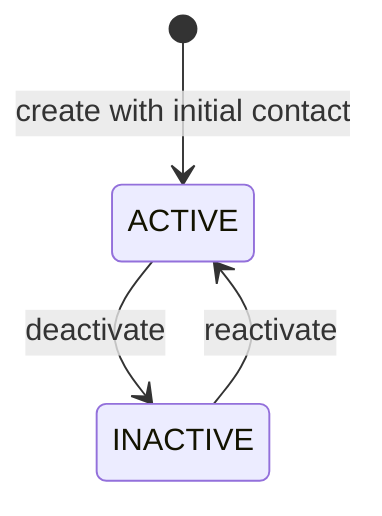

# M2 customer directory design

- **Status:** Proposed
- **Milestone:** M2 — Customer Directory
- **Tracking issue:** [#57](https://github.com/Felipao724/opsflow/issues/57)
- **Last reviewed:** 2026-10-04

This document defines the smallest customer and contact boundary that M2 will
implement. It is the contract for the following implementation issues, not
evidence that the functionality already exists. The guide must be updated to
describe the implemented result before M2 closes.

## Scope

M2 will let an authenticated member manage customers belonging to an OpsFlow
organization that the member is authorized to access.

The milestone covers:

- creating a customer with one required initial contact;
- listing every active and inactive customer in an authorized organization;
- reading one customer and all of its contacts;
- renaming, deactivating, and reactivating a customer;
- adding and updating contacts;
- physically removing a contact while retaining at least one; and
- an Angular directory, creation flow, and detail/maintenance flow.

M2 does not model work orders, services, billing, addresses, customer types,
tax data, imports, audit history, search, or pagination.

## Ubiquitous language

| Term | Meaning in M2 |
| --- | --- |
| Customer | A tenant-owned party for which the organization may later perform operational work. |
| Contact | A person or shared communication point owned by exactly one customer. |
| Active customer | A customer eligible for future operational work. M2 still allows its directory data to be maintained. |
| Inactive customer | A retained customer that cannot be selected for future services. M2 still allows it and its contacts to be read and edited. |
| Requested organization | The organization identified by the route. It is input, not proof of access. |
| Authorized tenant | The organization context returned after the M1 membership authorization boundary accepts the current identity. |

M2 does not distinguish a person from a company because that classification
does not currently change data requirements or behavior. Add a customer type
only when a real use case gives the categories different rules.

## Aggregate boundary

```text
Customer — aggregate root and entity
├── CustomerId — value object
├── OrganizationId — value object
├── CustomerName — value object
├── CustomerStatus — enum
└── Contact — owned entity
    ├── ContactId — value object
    ├── ContactName — value object
    ├── EmailAddress — optional value object
    └── MexicanPhoneNumber — optional value object
```

`Customer` is the only entry point for contact changes. Application code must
not persist or mutate a contact independently from its customer. The aggregate
exposes a read-only contact collection and compares entities by their typed
identifiers.

`OrganizationId` belongs only to `Customer`. Repeating it on every contact
would create two ownership values that could disagree. Tenant-scoped contact
operations instead resolve this chain:

```text
Authorized Organization
        │
        ▼
Customer.organizationId
        │
        ▼
Contact.customerId
```

## Value-object contracts

### `CustomerName` and `ContactName`

- Remove outer Unicode whitespace.
- Reject null, empty, and blank values.
- Limit customer and contact names to 120 Unicode code points.
- Preserve internal spacing and original character case.

Names are not unique. Different customers may share a name, and two contacts
may share a name.

### `EmailAddress`

- Remove outer whitespace.
- Reject blank values when an email is supplied.
- Limit the address to 254 characters.
- Apply a small syntactic check for a local part, `@`, and domain portion.
- Preserve the submitted case and do not use the value as an identity key.

The value object does not attempt to implement every valid email syntax, query
DNS, prove mailbox ownership, or make email unique. Those are different
capabilities and are not needed by M2.

### `MexicanPhoneNumber`

- Store exactly ten ASCII digits.
- Reject `+52`, spaces, parentheses, hyphens, letters, and other punctuation.
- Treat the stored ten digits as the canonical M2 representation.

The type name makes the geographic limitation visible. International support
requires a separate decision, input migration, and likely an E.164-oriented
model rather than silently weakening this contract.

## Aggregate invariants

1. Every customer belongs to exactly one organization.
2. Every customer has at least one contact.
3. Every contact belongs to exactly one customer.
4. A contact has a valid name and at least one of email or phone.
5. Email and phone may both be present.
6. Customer names, contact names, emails, and phones may repeat.
7. A contact ID is unique inside the aggregate and remains stable across edits.
8. Adding or updating a contact must pass the same value-object validation.
9. Removing the final contact is rejected.
10. Customer status changes only through explicit lifecycle operations.

The database can guarantee that each contact references a customer, but an
ordinary row-level constraint cannot guarantee that a customer always retains
one child row. The domain and application transaction enforce that direction
of the relationship.

## Customer lifecycle



`CustomerStatus` contains only `ACTIVE` and `INACTIVE`.

- Calling `deactivate` on an inactive customer is an invalid transition.
- Calling `reactivate` on an active customer is an invalid transition.
- Invalid or repeated transitions become `409 Conflict` at the HTTP boundary.
- Both statuses remain readable and editable in M2.
- Future service or work-order creation must require an active customer.
- Existing future historical work remains readable after deactivation.

The domain exposes intention-revealing operations rather than a public status
setter.

## Physical contact removal

M2 physically removes a contact row. It does not introduce `ContactStatus`, a
soft-delete flag, or contact history. This is safe only while no historical
business record references a contact.

Before a work order, service, message, or audit record stores `ContactId`, the
project must revisit this decision. The likely replacement is inactive contact
retention or an immutable snapshot on the historical record. A foreign key
from another table must use restrictive deletion so a new reference cannot be
silently destroyed.

## Tenant authorization

Every command and query starts with the organization requested by the route:

```text
/api/organizations/{organizationId}/customers
```

The path value selects the desired tenant but grants no authority. Application
services pass it to the M1 `TenantAuthorization` boundary, which derives the
current external identity from Spring Security and requires an active local
membership.

After authorization succeeds, customer repositories and queries remain scoped
by both `OrganizationId` and `CustomerId`. There is no application-facing
unscoped `findById(customerId)` operation.

The expected information boundary is:

- no valid access token: `401 Unauthorized`;
- valid identity without membership in the requested organization: `403 Forbidden`;
- authorized organization but unknown customer: `404 Not Found`;
- authorized organization but customer ID belongs to another tenant: `404 Not Found`;
- contact ID belongs to another customer: `404 Not Found`.

Returning `404` after tenant authorization prevents customer and contact IDs
from revealing another organization's data.

## Commands, queries, and transactions

M2 separates operations by intent without introducing a CQRS framework.

| Operation | Type | Transaction |
| --- | --- | --- |
| Create customer with initial contact | Command | Read-write |
| List organization customers | Query | Read-only |
| Read customer detail | Query | Read-only |
| Rename customer | Command | Read-write |
| Deactivate customer | Command | Read-write |
| Reactivate customer | Command | Read-write |
| Add contact | Command | Read-write |
| Update contact | Command | Read-write |
| Remove contact | Command | Read-write |

Application services own transaction boundaries. A write transaction surrounds
tenant authorization, aggregate loading, domain mutation, and persistence. A
repository does not commit independently. Queries use deliberate read models
and read-only transaction boundaries.

## HTTP resource model

All routes are under the requested organization:

| Operation | Method and path | Success |
| --- | --- | --- |
| Create customer | `POST /api/organizations/{organizationId}/customers` | `201 Created` |
| List customers | `GET /api/organizations/{organizationId}/customers` | `200 OK` |
| Read customer | `GET /api/organizations/{organizationId}/customers/{customerId}` | `200 OK` |
| Rename customer | `PATCH /api/organizations/{organizationId}/customers/{customerId}` | `200 OK` |
| Add contact | `POST /api/organizations/{organizationId}/customers/{customerId}/contacts` | `201 Created` |
| Replace contact details | `PUT /api/organizations/{organizationId}/customers/{customerId}/contacts/{contactId}` | `200 OK` |
| Remove contact | `DELETE /api/organizations/{organizationId}/customers/{customerId}/contacts/{contactId}` | `204 No Content` |
| Deactivate customer | `POST /api/organizations/{organizationId}/customers/{customerId}/deactivate` | `200 OK` |
| Reactivate customer | `POST /api/organizations/{organizationId}/customers/{customerId}/reactivate` | `200 OK` |

The command endpoints express business intent. The API does not accept a
generic client-controlled status assignment.

Path identifiers are not repeated in request bodies. `organizationId` is never
accepted as customer data, and `customerId` or `contactId` is never trusted from
a duplicate body field.

## Request contracts

Create a customer:

```json
{
  "name": "Taller del Norte",
  "initialContact": {
    "name": "Ana García",
    "email": "ana@example.com",
    "phone": "6141234567"
  }
}
```

Add a contact uses the contact object without the `initialContact` wrapper:

```json
{
  "name": "Luis García",
  "email": null,
  "phone": "6149876543"
}
```

Rename a customer:

```json
{
  "name": "Taller del Norte Chihuahua"
}
```

Replace a contact's editable details:

```json
{
  "name": "Luis García",
  "email": "luis@example.com",
  "phone": "6149876543"
}
```

Optional email and phone may be absent or `null`, but they may not both be
absent after normalization. Empty strings are invalid input rather than another
representation of absence.

Contact update uses `PUT` because the request replaces all editable contact
fields at a known resource URL. This avoids ambiguous partial-update semantics
where an omitted optional field and an explicit `null` would need different
meanings. Customer rename remains `PATCH` because it changes only the name.

## Response contracts

Customer summary:

```json
{
  "id": "77c3fcca-a590-48b9-b170-3b720820aa31",
  "name": "Taller del Norte",
  "status": "ACTIVE",
  "contactCount": 2
}
```

Customer detail:

```json
{
  "id": "77c3fcca-a590-48b9-b170-3b720820aa31",
  "organizationId": "50ee649f-a647-4375-9dd8-ed77597cbb3f",
  "name": "Taller del Norte",
  "status": "ACTIVE",
  "contacts": [
    {
      "id": "32e3a358-eb73-4ca0-94d7-1dbc113debd7",
      "name": "Ana García",
      "email": "ana@example.com",
      "phone": "6141234567"
    }
  ]
}
```

The initial list returns all statuses in deterministic name-and-ID order. It
uses customer summaries rather than reconstructing complete aggregates.

- Customer creation returns `201`, a `Location` for the customer, and customer detail.
- Contact creation returns `201`, a `Location` for the nested contact, and updated customer detail.
- Rename, lifecycle, and contact update commands return `200` and updated customer detail.
- Contact removal returns `204` with no response body.

Returning updated detail for non-delete mutations gives Angular authoritative
state without an immediate second request. Deletion needs no representation
because the client already knows which contact was removed.

## Error contract

Errors use the project's Problem Details conventions and do not expose SQL,
JWT claims, stack traces, or another tenant's identifiers.

| Condition | Status |
| --- | --- |
| Malformed JSON, invalid UUID, blank/long name, invalid email, invalid phone, or missing communication method | `400 Bad Request` |
| Missing or invalid bearer token | `401 Unauthorized` |
| Authenticated identity lacks membership in requested organization | `403 Forbidden` |
| Customer absent from authorized tenant or contact absent from customer | `404 Not Found` |
| Repeated invalid customer transition or attempt to remove final contact | `409 Conflict` |
| Unexpected application failure | Safe `500 Internal Server Error` |

Field errors use stable field paths such as `name`, `initialContact.email`, and
`phone`. Domain conflicts use stable problem types/codes rather than parsing
exception messages in Angular.

## Deliberate limits and revisit triggers

| Deferred capability | Trigger to revisit |
| --- | --- |
| Person/company customer type | The categories require different fields, validation, permissions, or workflows. |
| International phone numbers | The product serves contacts outside the Mexican national numbering contract. |
| Pagination | Before production assumptions allow unbounded tenant customer counts, or when measured payload/latency violates an agreed budget. |
| Search and filtering | Users cannot find customers efficiently from the initial ordered directory. |
| Contact retention | Another business or audit record needs a durable contact reference. |
| Optimistic locking | Concurrent customer edits cause demonstrated lost updates. |
| Audit history | A legal, support, or product requirement identifies actors and historical changes that must be retained. |
| Addresses, tax, billing, and work orders | The corresponding business milestone defines their rules. |

No generic CRUD framework, mapping library, CQRS bus, event system, cache, or
new frontend state library is introduced for this design.

## Validation plan

- Pure domain tests will prove value-object and aggregate invariants.
- PostgreSQL integration tests will prove schema constraints and tenant-scoped persistence.
- Application tests will prove authorization and transaction rollback.
- Controller tests will prove the HTTP and Problem Details contract.
- Angular client, state, and component tests will prove the directory and maintenance lifecycle.
- Negative two-organization scenarios will prove customer and contact isolation.

## References

- [M1 identity and tenancy architecture](m1-identity-and-tenancy-design.md)
- [ADR-0008: Use JPA with separate persistence models](decisions/0008-use-jpa-with-separate-persistence-models.md)
- [ADR-0010: Authorize tenants with local memberships](decisions/0010-authorize-tenants-with-local-memberships.md)
- [HTTP Semantics — RFC 9110](https://www.rfc-editor.org/rfc/rfc9110.html)
- [Spring declarative transactions](https://docs.spring.io/spring-framework/reference/data-access/transaction/declarative/annotations.html)
- [Mexican national ten-digit dialing](https://www.ift.org.mx/comunicacion-y-medios/marcacion-a-10-digitos)
